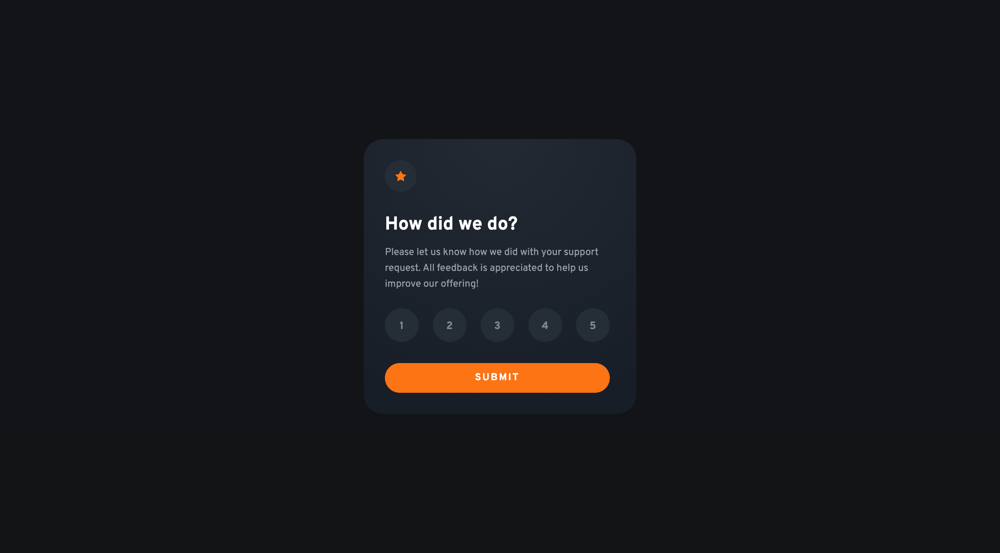
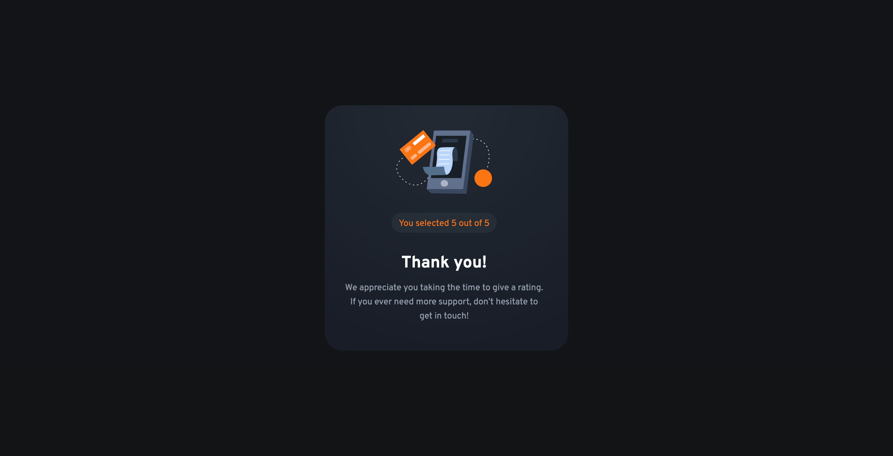

# Frontend Mentor - Interactive rating component solution

This is a solution to the [Interactive rating component challenge on Frontend Mentor](https://www.frontendmentor.io/challenges/interactive-rating-component-koxpeBUmI). Frontend Mentor challenges help you improve your coding skills by building realistic projects.

## Table of contents

- [Overview](#overview)
  - [The challenge](#the-challenge)
  - [Screenshot](#screenshot)
  - [Links](#links)
- [My process](#my-process)
  - [Built with](#built-with)
  - [What I learned](#what-i-learned)
- [Author](#author)

## Overview

### The challenge

Users should be able to:

- View the optimal layout for the app depending on their device's screen size
- See hover states for all interactive elements on the page
- Select and submit a number rating
- See the "Thank you" card state after submitting a rating

### Screenshots

### Links

- Solution URL: [Github](https://github.com/skurshner/fe-mentor/tree/main/interactive-rating-component-main)
- Live Site URL: [Live](https://sk-fem-rating-component.netlify.app/)

## My process

### Built with

- Semantic HTML5 markup
- CSS custom properties
- Flexbox
- Mobile-first workflow
- Javascript

### What I learned

I was a bit rusty working with Javascript and DOM manipulation. This was a pretty basic example but was a good way to shake off some of the dust. The original code that I wrote worked, but I knew it wasn't the optimal solution. I actually utilized ChatGPT to help me refactor the code and simplify it. Such a cool resource!

I added an error state for when a user doesn't select a rating but tries to submit. This wasn't in the designs but I felt it was necessary for good UX. There are a number of ways I could have done this, but decided to use helper text under the button. I could also imagine using a tooltip or another kind of alert.

## Author

- Frontend Mentor - [@skurshner](https://www.frontendmentor.io/profile/skurshner)
