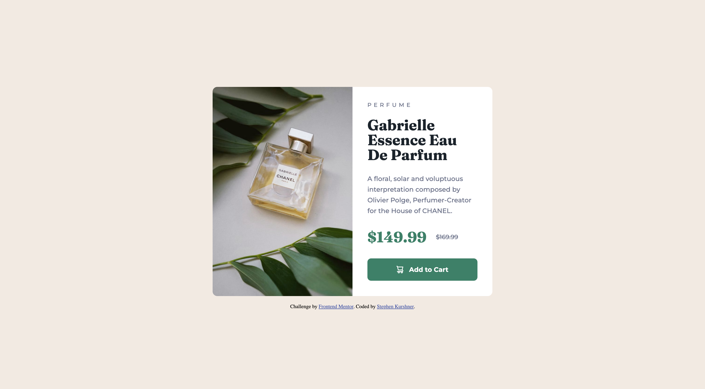

# Frontend Mentor - Product preview card component solution

This is a solution to the [Product preview card component challenge on Frontend Mentor](https://www.frontendmentor.io/challenges/product-preview-card-component-GO7UmttRfa). Frontend Mentor challenges help you improve your coding skills by building realistic projects.

## Table of contents

- [Overview](#overview)
  - [The challenge](#the-challenge)
  - [Screenshot](#screenshot)
  - [Links](#links)
- [My process](#my-process)
  - [Built with](#built-with)
  - [What I learned](#what-i-learned)
- [Author](#author)

## Overview

### The challenge

Users should be able to:

- View the optimal layout depending on their device's screen size
- See hover and focus states for interactive elements

### Screenshot

### Links

- Solution URL: [Solution](https://github.com/skurshner/fe-mentor/tree/main/product-preview-card-component-main)
- Live Site URL: [Live Site](https://sk-fe1.netlify.app/)

## My process

### Built with

- Semantic HTML5 markup
- CSS custom properties
- Flexbox
- Mobile-first workflow

### What I learned

I used this as a refresher back into html/css as I hadn't coded a lot recently. I completed a full-stack web development course over a year ago, but ended up finding a product position where those skills were not required on a day-to-day basis. I don't want them to lapse completely, so I've decided to do FE-mentor when I can to refresh myself. I'm looking forward to tackling more complicated builds in the future.

## Author

- Frontend Mentor - [@skurshner](https://www.frontendmentor.io/profile/skurshner)
