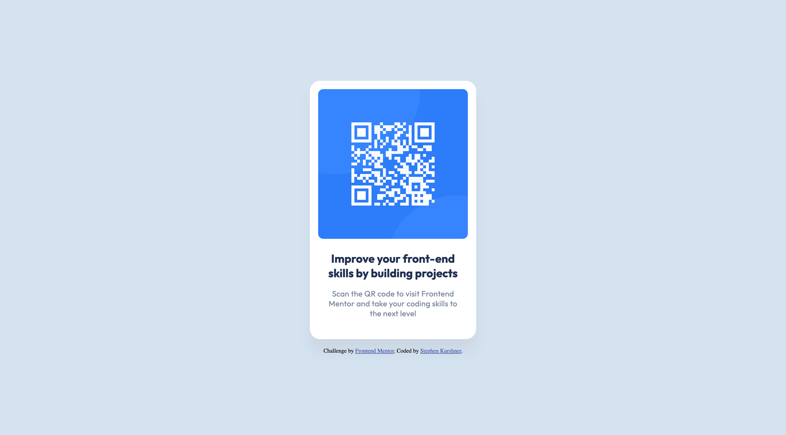

# Frontend Mentor - QR code component solution

This is a solution to the [QR code component challenge on Frontend Mentor](https://www.frontendmentor.io/challenges/qr-code-component-iux_sIO_H). Frontend Mentor challenges help you improve your coding skills by building realistic projects.

## Table of contents

- [Overview](#overview)
  - [Screenshot](#screenshot)
  - [Links](#links)
- [Author](#author)

## Overview

Another easy challenge to warm myself back up. I had originally started this one a while ago, but never submitted.

### Screenshot

### Links

- Solution URL: [Github](https://github.com/skurshner/fe-mentor/tree/main/qr-code-component-main)
- Live Site URL: [Live](https://sk-fm-qr.netlify.app/)

### Built with

- Semantic HTML5 markup
- CSS custom properties
- Flexbox

## Author

- Frontend Mentor - [@skurshner](https://www.frontendmentor.io/profile/skurshner)
